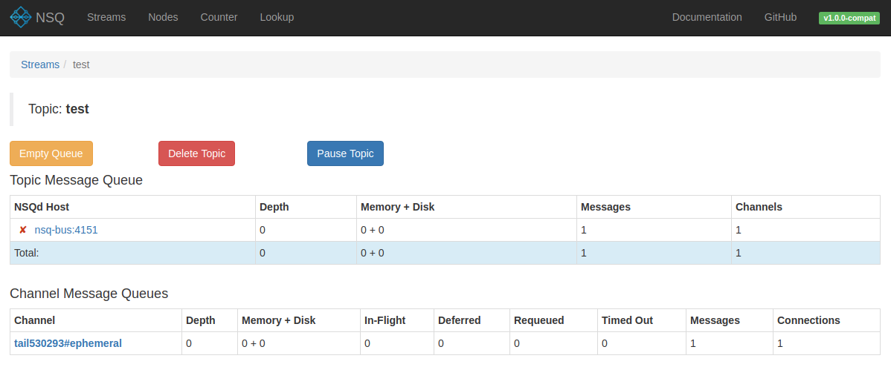
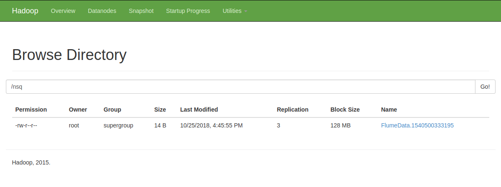

## Readme
This small project demonstrates consuming from [nsq](https://nsq.io/) to the Hadoop [HDFS](https://hortonworks.com/apache/hdfs/) file system with [Apache Flume](https://flume.apache.org/).

## Start
Start the services from the directory containing `docker-compose.yml`:

    $ docker-compose up -d

This will build the docker-flume image and start all the services listed in `docker-compose.yml`.

## Test
Send an example message to nsq like this:

    $ curl -d 'hello world 1' 'http://127.0.0.1:4151/pub?topic=test'

Check logs on nsq-flume to see the message being consumed and saved to HDFS:

    $ docker-compose logs nsq-flume

View the `test` topic on the NSQ admin console: http://localhost:4171/topics/test

To see the saved files, browse to [http://localhost:50070](http://localhost:50070), use Utilities (on the right) to see the files:

Note, when downloading the file, it may fail initially if it can't resolve the docker container name; you can substitute `localhost` in the url in place of the docker container name and you should be able to get to the node.

## Run a Spark Job
There is a simple Python [Spark](https://spark.apache.org/docs/latest/) example in the `python` directory. To run this, update `basic.py` with the path of a file saved to HDFS as described in the steps above. Then install the dependencies, ideally in a virtualenv, and run the file like this:

    $ cd python
    $ pip install -r requirements.txt
    $ python basic.py

This should produce a count of words in the file.
